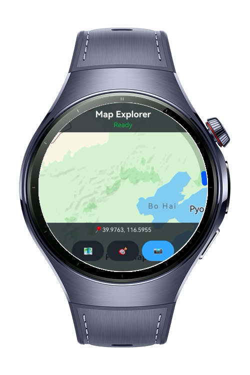
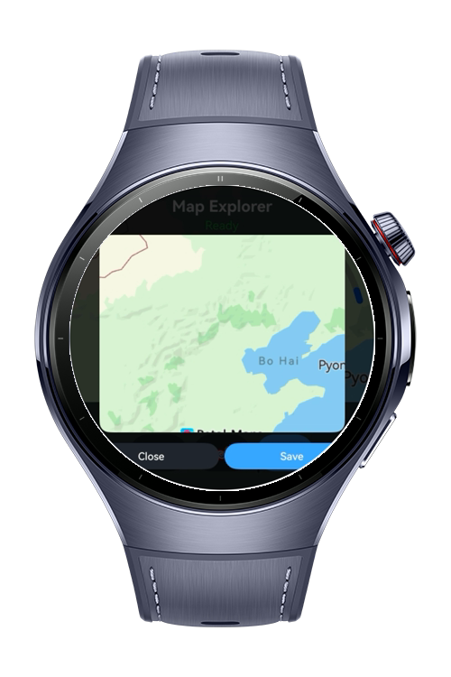
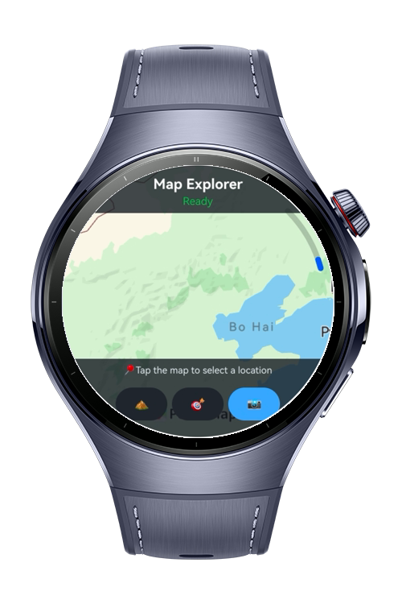

> **Note:** To access all shared projects, get information about environment setup, and view other guides, please visit [Explore-In-HMOS-Wearable Index](https://github.com/Explore-In-HMOS-Wearable/hmos-index).

# How to Integrate Map Kit

A HarmonyOS NEXT application demonstrating end-to-end Map Kit integration with MVVM architecture. Users can explore an interactive map with dynamic map type switching, animated camera movement, real-time tap coordinate display, and map screenshot capture. Built with ArkTS and ArkUI, the project showcases correct `MapComponent` initialization flow, `MapComponentController` lifecycle management, and `MapEventManager` event handling. The clean MVVM structure separates Map Kit API calls into a dedicated service layer, making it easy to extend with additional features like markers, route planning, or location tracking. Perfect for developers learning HarmonyOS NEXT Map Kit integration and reactive state management patterns.

# Preview

<div>
  
  
  
</div>

# Use Cases

- End-to-end Map Kit initialization and lifecycle management
- Dynamic map type switching (Standard / Terrain)
- Animated camera movement to predefined locations
- Real-time tap coordinate feedback via `MapEventManager`
- In-memory map screenshot capture and preview
- Error state handling with retry mechanism
- MVVM architecture with `@Observed` and `@State` decorators

# Tech Stack

- **Languages:** ArkTS, ArkUI
- **Frameworks:** HarmonyOS NEXT SDK
- **Tools:** DevEco Studio NEXT
- **Libraries:**
  - `@kit.MapKit`
  - `@kit.BasicServicesKit`
  - `@kit.ImageKit`

# Directory Structure

```
└── entry/src/main/ets/
├── model/
│   └── MapState.ets
├── service/
│   └── MapService.ets
├── viewmodel/
│   └── MapViewModel.ets
└── pages/
└── MapPage.ets
```

# Constraints and Restrictions

### Supported Devices

- Huawei Watch (HarmonyOS NEXT wearables)

***Notes***

- Map Kit requires a valid AppGallery Connect project with Map Kit enabled and a matching signing certificate fingerprint registered in the console.

# License

How to Integrate Map Kit is distributed under the terms of the MIT License.

See the [LICENSE](LICENSE) file for more information.